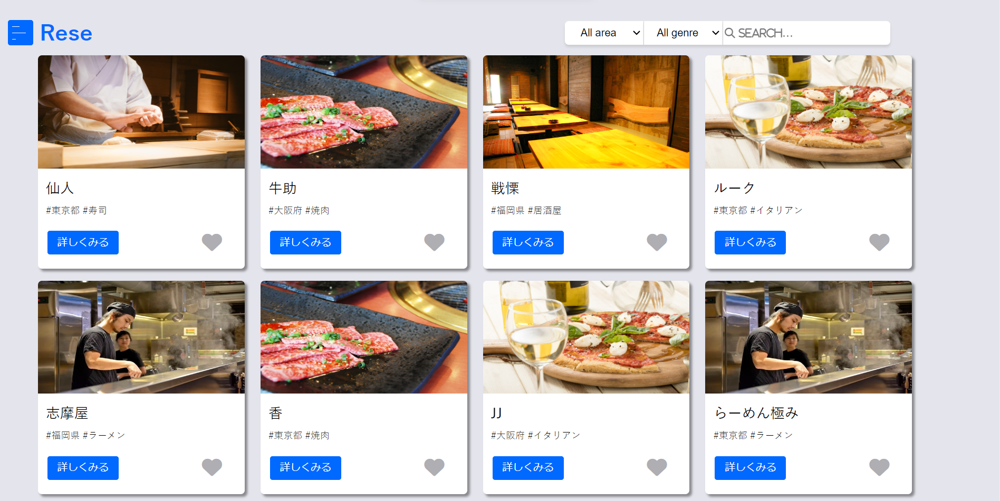
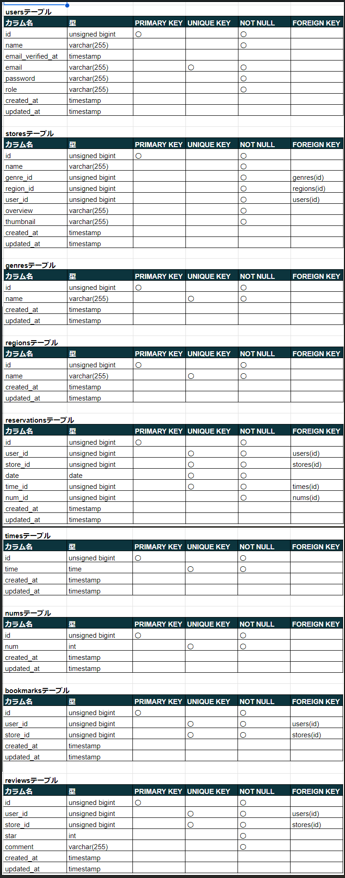
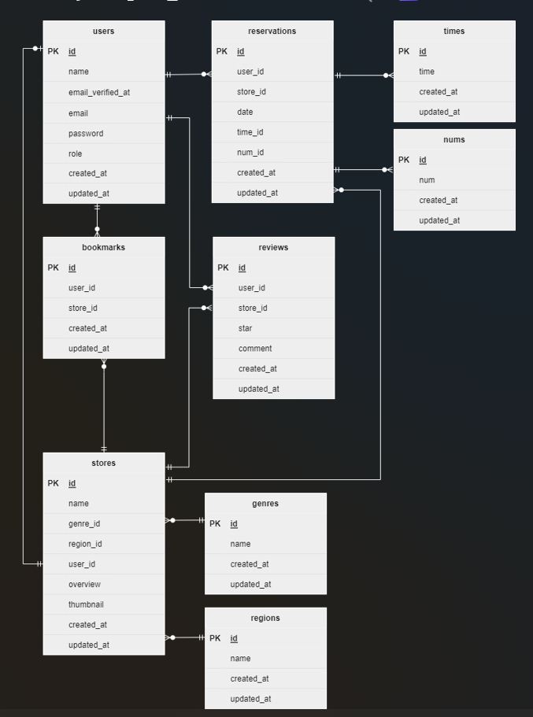

# reservation（予約サービス）

概要説明：会社に属する各飲食店の予約サービス

## 作成した目的

概要：外部の飲食店予約サービスは手数料がかかるため、自社で予約サービスを持ちたい。

## アプリケーション URL

WEB アプリ URL：http://18.182.152.167/

AWS 　（IAM ユーザとしてコンソールにサインインする場合は以下を使用してください）  
・コンソールサインイン：https://058264478200.signin.aws.amazon.com/console  
・ユーザー名：testuser  
・コンソールパスワード：testuser1&  
・パブリック IP アドレス：18.182.152.167

## 他のリポジトリ

GitHub（https）：https://github.com/MinaYamamoto/reservation.git

## 機能一覧

・飲食店情報一覧表示機能

・飲食店エリア検索機能

・飲食店ジャンル検索機能

・飲食店店名検索機能

・飲食店詳細情報取得・表示機能

・会員登録機能（メールによる認証機能あり）

・ログイン機能

・ログアウト機能

・飲食店予約情報追加機能

・飲食店予約情報変更機能

・飲食店予約情報削除機能

・飲食店予約情報確認 QR コード発行機能

・飲食店予約情報リマインダー機能

・飲食店お気に入り追加機能

・飲食店お気に入り解除機能

・飲食店レビュー投稿機能

・飲食店レビュー変更機能

・飲食店レビュー削除機能

・ユーザ情報取得機能

・ユーザ飲食店お気に入り一覧取得機能

・ユーザ飲食店予約情報取得機能

・ユーザ飲食店レビュー一覧取得機能

・決済機能

---

管理者機能

・店舗代表者登録機能

---

店舗代表者機能

・店舗情報作成機能

・店舗情報変更機能

・予約情報一覧表示機能

・予約情報詳細表示機能

・メール送信機能

## 使用技術（実行環境）

・PHP:8.0

・Laravel:8.83.27

・MySQL:8.0.35

・docker-compose:2.24.6

## テーブル設計

## ER 図

## 環境構築

**Docker ビルド**

1.任意のフォルダを作成

2.コマンドより「1.」で作成した任意のフォルダに移動し、reservation.git をクローンする  
git clone git@github.com:MinaYamamoto/reservation.git

3.「reservation」フォルダに移動し、docker をビルドする  
docker-compose up -d --build

---

**Laravel 環境構築**

1.PHP コンテナ内にログイン  
docker-compose exec php bash

2.ログイン後、必要なパッケージをインストール  
composer install

3.「.env.example」ファイルをコピーして「.env」ファイルを作成  
cp .env.example .env

4.「.env」ファイルの環境変数を変更  
DB_HOST=mysql  
DB_DATABASE=laravel_db  
DB_USERNAME=laravel_user  
DB_PASSWORD=laravel_pass  
MAIL_HOST=sandbox.smtp.mailtrap.io  
MAIL_PORT=2525  
MAIL_USERNAME=b3190c220e7b27  
MAIL_PASSWORD=68173c9d406bab  
MAIL_ENCRYPTION=tls  
MAIL_FROM_ADDRESS=mailtrap@example.com  
STRIPE_KEY=pk_test_51OpqbqGivG6QeAc8ivudeS0M2aaZinAWQPoP3hcBaiOrGpF1JIm4q1N38bnXP6l1TipAsRGXsowyNCMZ8hdzxXR600RZYYYbhY  
STRIPE_SECRET=sk_test_51OpqbqGivG6QeAc8cUx81ZujodFv8JFM3DXXkdVoDrJjSm7VgZQH9zBeStBRWdVUVWabLLeXgrHA6i3JIIg6zopb00076VqsLK  
STRIPE_BASIC_ID=price_1OqZTjGivG6QeAc8TxoCySbv  
CASHIER_CURRENCY=jpy

5.アプリケーション起動のためのキーを生成  
php artisan key:generate

6.マイグレーションを実行  
php artisan migrate

7.データベースへテスト用の初期データを投入  
php artisan db:seed

8.シンボリックリンクを作成  
php artisan storage:link

9.storage>app>public フォルダに post_img フォルダを作成

10.「reservation」配下にある以下ファイルを「9.」で作成した post_img フォルダに格納  
　 sushi.jpg  
　 yakiniku.jpg  
　 ramen.jpg  
　 italian.jpg  
　 izakaya.jpg

## その他記述

・テスト用ログインユーザ

_管理者_  
　　 Email：admin@email.com  
　　 Password：12345678

_店舗代表者_  
　　 Email：representative@email.com  
　　 Password：12345678

_一般_  
　　 Email：user@email.com  
　　 Password：12345678

・開発環境はローカル、本番環境は AWS を使用しています。

・AWS は SSL 認証の設定を行っていません。「http」にてアクセスしてください。

・AWS へのデプロイは以下を使用しています。  
　 AWS 　 CodePipeline  
　　名前：reservation

　AWS 　 CodeDeploy  
　　アプリケーション名：reservation  
　　デプロイグループ：reservation

・メールの確認には mailtrap を使用しています。  
　 mailtrap ログイン情報  
　　 Email: coachtechmytest@gmail.com  
　　 Password coachtechmytest1!

・決済には stripe を使用しています。  
　 stripe ログイン情報  
　　 URL：https://dashboard.stripe.com/login  
　　 Email：motitama1106@gmail.com  
　　 Password：coachtechmytest1!
