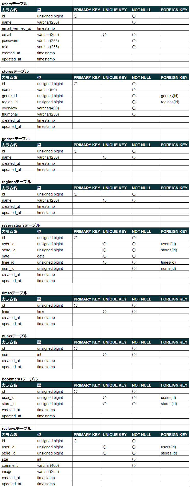

# reservation（予約サービス）

概要：会社に属する各飲食店の予約サービス

## 作成した目的

概要：外部の飲食店予約サービスは手数料がかかるため、自社で予約サービスを持ちたい。

## アプリケーション URL

WEB アプリ URL：http://18.182.152.167/

## 他のリポジトリ

GitHub（https）：https://github.com/MinaYamamoto/reservation.git

AWS 　 S3  
・名前：reservation-bucket1

## 機能一覧

・飲食店情報一覧表示機能

・飲食店情報一覧ソート機能

・飲食店エリア検索機能

・飲食店ジャンル検索機能

・飲食店店名検索機能

・飲食店詳細情報取得・表示機能

・会員登録機能（メールによる認証機能あり）

・ログイン機能

・ログアウト機能

・飲食店予約情報追加機能

・飲食店予約情報変更機能

・飲食店予約情報削除機能

・飲食店予約情報確認 QR コード発行機能

・飲食店予約情報リマインダー機能

・飲食店お気に入り追加機能

・飲食店お気に入り解除機能

・飲食店口コミ投稿機能

・飲食店口コミ変更機能

・飲食店口コミ削除機能

・ユーザ情報取得機能

・ユーザ飲食店お気に入り一覧取得機能

・ユーザ飲食店予約情報取得機能

・ユーザ飲食店レビュー一覧取得機能

・決済機能

**管理者機能**

・店舗代表者登録機能

・店舗情報作成機能（CSV インポート）

・飲食店口コミ削除機能

**店舗代表者機能**

・店舗情報作成機能

・店舗情報変更機能

・予約情報一覧表示機能

・予約情報詳細表示機能

・メール送信機能

## 使用技術（実行環境）

・PHP:8.0

・Laravel:8.83.27

・MySQL:8.0.35

・docker-compose:2.24.6

## テーブル設計

## ER 図

## 環境構築

**Docker ビルド**

1.任意のフォルダを作成

2.コマンドより「1.」で作成した任意のフォルダに移動し、reservation.git をクローンする  
git clone git@github.com:MinaYamamoto/reservation.git

3.「reservation」フォルダに移動し、docker をビルドする  
docker-compose up -d --build

---

**Laravel 環境構築**

1.PHP コンテナ内にログイン  
docker-compose exec php bash

2.ログイン後、必要なパッケージをインストール  
composer install

3.「.env.example」ファイルをコピーして「.env」ファイルを作成  
cp .env.example .env

4.「.env」ファイルの環境変数を変更  
DB_HOST=mysql  
DB_DATABASE=laravel_db  
DB_USERNAME=laravel_user  
DB_PASSWORD=laravel_pass  
MAIL_HOST=mailtrip の SMTP Settings タブより設定値をコピー  
MAIL_PORT=mailtrip の SMTP Settings タブより設定値をコピー  
MAIL_USERNAME=mailtrip の SMTP Settings タブより設定値をコピー  
MAIL_PASSWORD=mailtrip の SMTP Settings タブより設定値をコピー  
MAIL_ENCRYPTION=mailtrip の SMTP Settings タブより設定値をコピー  
MAIL_FROM_ADDRESS=mailtrip の SMTP Settings タブより設定値をコピー  
STRIPE_KEY=stripe の公開可能キー  
STRIPE_SECRET=stripe のシークレットキー  
STRIPE_BASIC_ID=stripe にて任意の商品カタログの APIID  
CASHIER_CURRENCY=jpy

5.アプリケーション起動のためのキーを生成  
php artisan key:generate

6.マイグレーションを実行  
php artisan migrate

7.データベースへテスト用の初期データを投入  
php artisan db:seed

8.シンボリックリンクを作成  
php artisan storage:link

9.storage>app>public フォルダに post_img フォルダを作成

10.「reservation」配下にある以下ファイルを「9.」で作成した post_img フォルダに格納  
　 sushi.jpeg  
　 yakiniku.jpeg  
　 ramen.jpeg  
　 italian.jpeg  
　 izakaya.jpeg

## その他記述

・テスト用ログインユーザ

_管理者_  
　　 Email：admin@email.com  
　　 Password：12345678

_店舗代表者_  
　　 Email：representative@email.com  
　　 Password：12345678

_一般_  
　　 Email：user@email.com  
　　 Password：12345678

・開発環境はローカル、本番環境は AWS を使用しています。

・AWS は SSL 認証の設定を行っていません。「http」にてアクセスしてください。

・AWS へのデプロイは以下を使用しています。  
_CodePipeline_  
　　名前：reservation

_CodeDeploy_  
　　アプリケーション名：reservation  
　　デプロイグループ：reservation

・メールの確認には mailtrap を使用しています。  
　　 URL：https://mailtrap.io/email-sandbox/

・決済には stripe を使用しています。  
　　 URL：https://dashboard.stripe.com/
　　商品カタログより、任意の商品を１つ追加してください。

_CSV インポート機能（ファイル定義）_  
・CSV インポート用のファイル定義は以下の通りです。
　　店舗名（50 文字以内）,ジャンル(注 1),地域(注 2),店舗概要（400 文字以内）,画像 URL(注 3)

注１：ジャンルの設定値
|設定値|ジャンル名|
| --- | --- |
| 1 | 寿司 |
| 2 | イタリアン |
| 3 | ラーメン |
| 4 | 居酒屋 |
| 5 | 焼肉 |

注２：地域の設定値
|設定値|地域名|
| --- | --- |
| 1 | 東京都 |
| 2 | 大阪府 |
| 3 | 福岡県 |

注３：画像 URL の設定値
　　登録可能な画像ファイル拡張子は「jpeg」「png」となります。
　　以下フォルダに格納された画像について設定可能です。
　　 src\storage\app\public\post_img
　　設定例）/storage/post_img/sushi.jpeg

・CSV インポート用のファイル定義の設定例
　　〇　店名：テスト店舗
　　〇　ジャンル：イタリアン
　　〇　地域：福岡県
　　〇　店舗概要：テスト店舗用概要
　　〇　画像 URL：src\storage\app\public\post_img\italian.jpeg
　　上記内容で店舗登録を行う場合のファイル定義は以下の通りとなります。
　　　　テスト店舗,2,3,テスト店舗用概要,/storage/post_img/italian.jpeg
